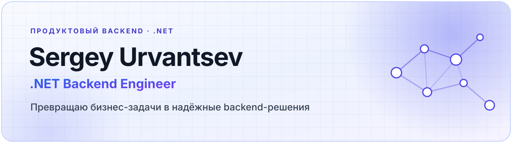

  

## Обо мне

Я **.NET Backend Engineer**. Разрабатываю серверные системы и превращаю бизнес-задачи в понятные, надёжные и сопровождаемые технические решения.

Ценю прагматичный подход: сначала разобраться в задаче и ожидаемом результате, затем выбрать архитектуру и инструменты, которые помогут продукту развиваться без лишней сложности.

## Основной стек

**Backend**  
`C#` · `.NET` · `ASP.NET Core` · `Entity Framework Core`

**Данные и интеграции**  
`PostgreSQL` · `Redis` · `RabbitMQ`

**Инфраструктура и доставка**  
`Docker` · `CI/CD` · `Kubernetes`

## Мой подход

- Начинаю с пользовательской или бизнес-проблемы, а не с технологии.
- Выбираю решения, которые удобно развивать, тестировать и поддерживать.
- Сохраняю баланс между скоростью поставки, качеством и стоимостью будущих изменений.
- Довожу функциональность до законченного и предсказуемого результата.

## Профили

[GitHub](https://github.com/SergeyUrvantsev) · [LeetCode](https://leetcode.com/u/SergeyUrv/)
